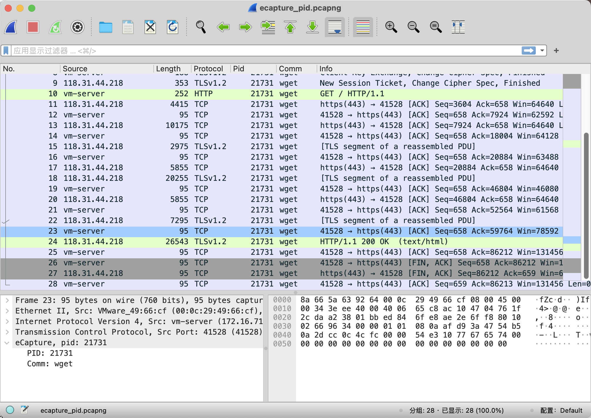
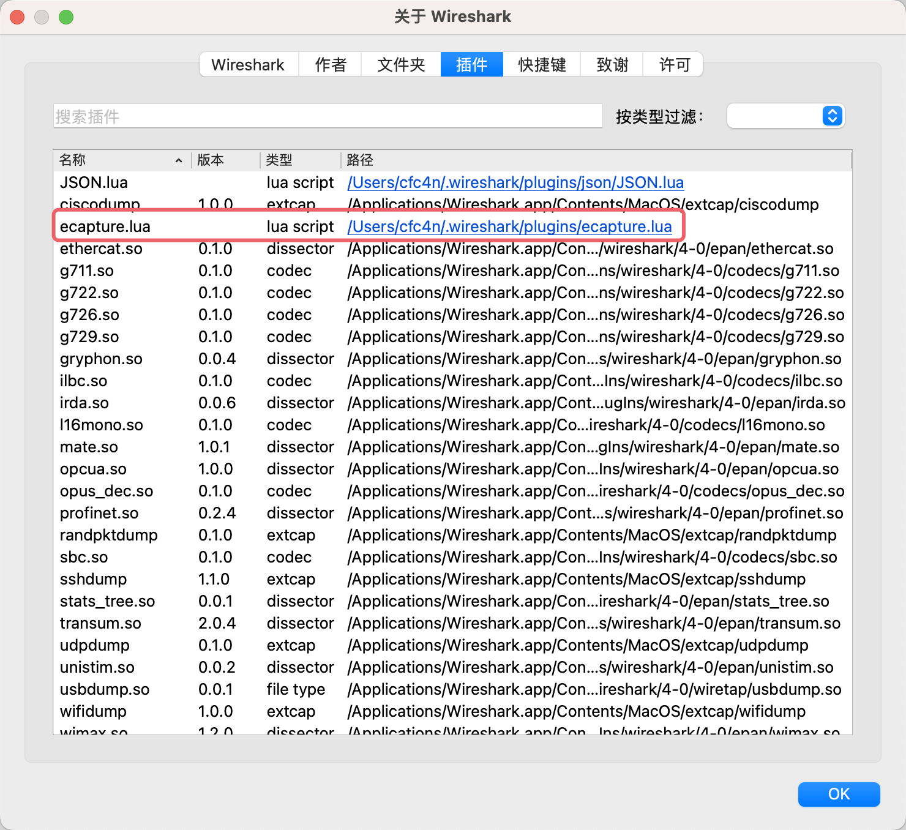

<hr>

# v0.6.1 (2023-07-16)
## What's Changed
* fix #378 , error: use of undeclared identifier 'KBUILD_MODNAME'  by @cfc4n in https://github.com/gojue/ecapture/pull/379
* feat:add openssl 1.1.1u and 3.0.9   by @cfc4n in https://github.com/gojue/ecapture/pull/380

**Full Changelog**: https://github.com/gojue/ecapture/compare/v0.6.0...v0.6.1

<hr>

# v0.6.0 (2023-07-02)
## 🚀 Breaking Changes
Associating process information with network packets. usage: `cp utils/ecapture.lua ~/.wireshark/plugins` .



## What's Changed
* code refactoring by @cfc4n in https://github.com/gojue/ecapture/pull/371
* Tls response unexpected eof by @cfc4n in https://github.com/gojue/ecapture/pull/372
* modify func isCOntainerCgroup to isContainerCgroup, and where referenced by @chusyclub in https://github.com/gojue/ecapture/pull/374
* feat: Associate corresponding process information with each network packet. by @cfc4n in https://github.com/gojue/ecapture/pull/376

**Full Changelog**: https://github.com/gojue/ecapture/compare/v0.5.3...v0.6.0

<hr>

# v0.5.3 (2023-05-21)
## What's Changed
* user: fixes slice out of range by @cfc4n in https://github.com/gojue/ecapture/pull/366

**Full Changelog**: https://github.com/gojue/ecapture/compare/v0.5.2...v0.5.3

<hr>

# v0.5.2 (2023-05-01)
## What's Changed
* add CircleLinux rpm and mannul build support by @bella485 in https://github.com/gojue/ecapture/pull/345
* gomod: update github.com/mdlayher/netlink to v1.7.1 by @cfc4n in https://github.com/gojue/ecapture/pull/348
* use makefile to build rpm by @xjas in https://github.com/gojue/ecapture/pull/344
* fix : DumpResponse error: unexpected EOF  by @cfc4n in https://github.com/gojue/ecapture/pull/349
* bugfix: Error unknown flag gobin (fixes #354 ) by @cfc4n in https://github.com/gojue/ecapture/pull/355
* GitHub actions deprecating by @cfc4n in https://github.com/gojue/ecapture/pull/356
* kern : support gotls request and response by @cfc4n in https://github.com/gojue/ecapture/pull/357
* user: fixes the network card ID cannot be found when writing to a pcapng file. (#347) by @cfc4n in https://github.com/gojue/ecapture/pull/358

**Full Changelog**: https://github.com/gojue/ecapture/compare/v0.5.1...v0.5.2

<hr>

# v0.5.1 (2023-04-08)
## What's Changed
* user: add ifname's default value of gotls module. by @cfc4n in https://github.com/gojue/ecapture/pull/332
* kern: fix wrong uid by @lazybetrayer in https://github.com/gojue/ecapture/pull/334
* support rpm build by @xjas in https://github.com/gojue/ecapture/pull/341
* pkg : add proc(go version) unit testing by @cfc4n in https://github.com/gojue/ecapture/pull/342

**Full Changelog**: https://github.com/gojue/ecapture/compare/v0.5.0...v0.5.1

<hr>

# v0.5.0 (2023-03-10)

## What's Changed
* fix: typo in the section name by @spacewander in https://github.com/gojue/ecapture/pull/311
* user : increase buffer size of ebpf map. (improve #291 , #314) by @cfc4n in https://github.com/gojue/ecapture/pull/315
* build(deps): bump golang.org/x/net from 0.0.0-20211112202133-69e39bad7dc2 to 0.7.0 by @dependabot in https://github.com/gojue/ecapture/pull/320
* refactor : rename Golang TLS module name to gotls from gossl . by @cfc4n in https://github.com/gojue/ecapture/pull/319
* refactor: Use camel case instead of snake case. by @cfc4n in https://github.com/gojue/ecapture/pull/321
* kern: fix typo in bpf_tracing.h by @eltociear in https://github.com/gojue/ecapture/pull/323
* Add JA readme by @eltociear in https://github.com/gojue/ecapture/pull/324
* Gotls crash : incorrect variable used. (fixes:#322)  by @cfc4n in https://github.com/gojue/ecapture/pull/325
* kern: refactor golang ABI by register and stack. by @cfc4n in https://github.com/gojue/ecapture/pull/326
* feat: add Gotls master secrets module. by @cfc4n in https://github.com/gojue/ecapture/pull/329

**Full Changelog**: https://github.com/gojue/ecapture/compare/v0.4.12...v0.5.0

<hr>

# v0.4.12 (2023-02-10)

## What's Changed
* pkg: get GoVersion by `buildinfo` package from ELF (by golang compiled)  (#262) by @cfc4n in https://github.com/gojue/ecapture/pull/295
* docs: fixes supported kernel version on arm64(aarch64).  (#296) by @cfc4n in https://github.com/gojue/ecapture/pull/298
* user: fixes slice bounds out of range bug (#297) by @cfc4n in https://github.com/gojue/ecapture/pull/299
* kern: fixes constant value of type uint64. (#301) by @cfc4n in https://github.com/gojue/ecapture/pull/302
* package: update gojue/ebpfmanager to v0.4.1  by @cfc4n in https://github.com/gojue/ecapture/pull/305
* docs: update README.md by @onism68 in https://github.com/gojue/ecapture/pull/306


**Full Changelog**: https://github.com/gojue/ecapture/compare/v0.4.11...v0.4.12

<hr>

# v0.4.11 (2023-01-07)

## What's Changed
* builder: fix typos (#285) by @cfc4n in https://github.com/gojue/ecapture/pull/286
* Tls 13 masterkey is taken wrong (fixes #283) by @cfc4n in https://github.com/gojue/ecapture/pull/284
* fix(gossl): invalid memory address or nil pointer by @luckymrwang in https://github.com/gojue/ecapture/pull/288


**Full Changelog**: https://github.com/gojue/ecapture/compare/v0.4.10...v0.4.11

<hr>

# v0.4.10 (2022-12-11)

## What's Changed
* builder: add curl shell to install develop environment. by @cfc4n in https://github.com/gojue/ecapture/pull/272
* docs : update minimal kernel version as 4.18 (#274) by @cfc4n in https://github.com/gojue/ecapture/pull/275
* kern: capture https plaintext failed with boringssl TLS 1.3 on android #271 by @cfc4n in https://github.com/gojue/ecapture/pull/279


**Full Changelog**: https://github.com/gojue/ecapture/compare/v0.4.9...v0.4.10

<hr>

# v0.4.9 (2022-11-19)

## What's Changed
* constant value has to be of type uint64 (#261) by @cfc4n in https://github.com/ehids/ecapture/pull/264
* builder: rename android non-core archive file name by @cfc4n in https://github.com/ehids/ecapture/pull/266
* chore(openssl/boringssl): remove redundant calculation by @blaisewang in https://github.com/ehids/ecapture/pull/267
* makefile : support make parallel （#265） by @cfc4n in https://github.com/ehids/ecapture/pull/268
* disable gnutls/nss modules on Android. by @cfc4n in https://github.com/ehids/ecapture/pull/269


**Full Changelog**: https://github.com/ehids/ecapture/compare/v0.4.8...v0.4.9

<hr>

# v0.4.8 (2022-11-05)

## Breaking Changes

1. Changed license to Apache License 2.0 from AGPL 3.0.
2. Supported versions of openssl are 1.1.0* , 1.0.2* .
3. Supported minimum version of Clang is 9.0.
4. Added GitHub release action of Android X86_64 binaries(default: non-CORE version).

## What's Changed
* user : Tolower openssl version strings. by @cfc4n in https://github.com/ehids/ecapture/pull/250
* cli : remove other modules on android. by @cfc4n in https://github.com/ehids/ecapture/pull/251
* utils: add eCapture lua script for wireshark plugin. by @cfc4n in https://github.com/ehids/ecapture/pull/248
* feat: updated new openssl version by @cfc4n in https://github.com/ehids/ecapture/pull/255
* feat : support openssl 1.1.0* and 1.0.2* by @cfc4n in https://github.com/ehids/ecapture/pull/257
* fix: Build failed on clang10 (#256) by @cfc4n in https://github.com/ehids/ecapture/pull/258
* docs : Change license to Apache License 2.0 by @cfc4n in https://github.com/ehids/ecapture/pull/259
* workflows :  release Android x86_64 use nocore model. by @cfc4n in https://github.com/ehids/ecapture/pull/260

**Full Changelog**: https://github.com/ehids/ecapture/compare/v0.4.7...v0.4.8
<hr>

# v0.4.7 (2022-10-23)

## Breaking Changes
**add `--ssl_version` flag to set the SSL libraries version**
supported ssl libraries version lists:
- openssl 1.1.1* , (1.1.1a - 1.1.1r)
- openssl 3.0.* , (3.0.0 - 3.0.6)
- boringssl 1.1.1

```bash
ecapture tls
ecapture tls --hex --pid=3423
ecapture tls -l save.log --pid=3423
ecapture tls --libssl=/lib/x86_64-linux-gnu/libssl.so.1.1
ecapture tls -w save_3_0_5.pcapng --ssl_version="openssl 3.0.5" --libssl=/lib/x86_64-linux-gnu/libssl.so.3 
ecapture tls -w save_android.pcapng -i wlan0 --libssl=/apex/com.android.conscrypt/lib64/libssl.so --ssl_version="boringssl 1.1.1" --port 443
```


## What's Changed
* feat : support openssl 3.0 @cfc4n in https://github.com/ehids/ecapture/pull/244
* feat: automate openssl offset header file generation @blaisewang in https://github.com/ehids/ecapture/pull/241

<hr>

# v0.4.6 (2022-10-15)

## What's Changed
* user/module : compatiable Linux kernel less or more than 5.2   @cfc4n in https://github.com/ehids/ecapture/pull/238

<hr>

# v0.4.5 (2022-10-10)

## What's Changed
* kern: capture master secrets for tls 1.3  @cfc4n in https://github.com/ehids/ecapture/pull/232

<hr>

# v0.4.4 (2022-10-03)

## What's Changed
* feat: add support TLSv1.3 decryption by @blaisewang in https://github.com/ehids/ecapture/pull/209
* user/module : hex model output. by @cfc4n in https://github.com/ehids/ecapture/pull/220
* user/module : use const for SSL masterKey function hook. by @cfc4n in https://github.com/ehids/ecapture/pull/217
* kern: rodata map not supported on kernel 4.19 or older by @cfc4n in https://github.com/ehids/ecapture/pull/223
* kern: http2 response packet decode failed. by @cfc4n in https://github.com/ehids/ecapture/pull/225

<hr>

# v0.4.3 (2022-09-09)

## What's Changed
* fix: use cipher id to derive secret by @blaisewang in https://github.com/ehids/ecapture/pull/192
* kern: get ssl_session in the `*SSL_get_session()` order .   by @cfc4n in https://github.com/ehids/ecapture/pull/193

<hr>

# v0.4.2 (2022-09-04)

## What's Changed
* refactor user package. by @cfc4n in https://github.com/ehids/ecapture/pull/183
* pkg/event_processor: DefaultParser init(). by @cfc4n in https://github.com/ehids/ecapture/pull/186
* Fix: correct ssl_st member offsets by @blaisewang in https://github.com/ehids/ecapture/pull/184
* Boringssl decrypt failed by @cfc4n in https://github.com/ehids/ecapture/pull/188

<hr>

# v0.4.1 (2022-08-21)

## What's Changed
* kern : define variable target_port always. by @cfc4n in https://github.com/ehids/ecapture/pull/157
* workflows : build nocore version for Android default. by @cfc4n in https://github.com/ehids/ecapture/pull/159
* pkg : Ifname default value. by @cfc4n in https://github.com/ehids/ecapture/pull/161
* user : skip loopback network interface by @cfc4n in https://github.com/ehids/ecapture/pull/163
* user : tls models exit gracefully. by @cfc4n in https://github.com/ehids/ecapture/pull/165
* git: ignore .check* files by @blaisewang in https://github.com/ehids/ecapture/pull/168
* pkg : fix config file parse failed, when as gzip format. by @cfc4n in https://github.com/ehids/ecapture/pull/169
* fix gzip read err by @4ft35t in https://github.com/ehids/ecapture/pull/175
* pkg/util/ebpf : add unit testing for kernel CONFIG reader by @cfc4n in https://github.com/ehids/ecapture/pull/176
* user : fix incorrect TimeStamp by @cfc4n in https://github.com/ehids/ecapture/pull/179
* cli/cmd : print version info by @cfc4n in https://github.com/ehids/ecapture/pull/177
* kern : support boringssl offset for Android 12. by @cfc4n in https://github.com/ehids/ecapture/pull/181

<hr>

# v0.4.0 (2022-08-07)

## Breaking Changes

**Support : capture plaintext packet as pcapng files for openssl TLS encryption.**

> **Note:**
>
> Support `Wireshark` to open directly. Do not need to setting up `Master Secrets` files.
>
> Capture `raw packet` by Traffic Control eBPF filter. Added `Master Secrets` information into pcapng
> with `Decryption Secrets Block` (DSB).

> **Warning**
>
> change `loggerFile` flag as `-l` from `-w` , because `-w` is reserved for `Wireshark`, and keep same as `-w`
> for `tcpdump`. use `ecapture -h` for help.
> change `master secrets` filename from `ecapture_masterkey_[pid].log` to `ecapture_masterkey.log`.

## What's Changed

* new feature: capture TLS 1.3 master secret by @cfc4n in https://github.com/ehids/ecapture/pull/143
* user : echo String() or StringHex() by CLI argument. by @cfc4n in https://github.com/ehids/ecapture/pull/149
* cli/cmd : clean up all probe while process exit. (#150) by @cfc4n in https://github.com/ehids/ecapture/pull/151
* save as Pcapng files #145 by @cfc4n in https://github.com/ehids/ecapture/pull/148
* user : Support writing pcapng files with Decryption Secrets Block (DSB). by @cfc4n
  in https://github.com/ehids/ecapture/pull/153

<hr>

# v0.3.0 (2022-07-20)

## Breaking Changes

**Capture TLS master_key ,save to file. Support openssl `1.1.1.X` . `TLS 1.2` .**

Quick Guide:

- use `ecapture` to capture TLS master_key, will save master secret to `ecapture_masterkey_[pid].log`.
- use `tcpdump` to capture and save packets to `xxx.pcapng` file.
- open `xxx.pcapng` file with `wireshark`.
- Setting : `Wireshark` --> `Preferences` -->  `Protocols` --> `TLS` --> `(Pre)-Master-Secret log filename`, select `ecapture_masterkey_[pid].log`.
- Using : right click packet item, select `follow` -> `HTTP Stream` / `HTTP/2 Stream`

## What's Changed
* all : refactor event_processor EventType. by @cfc4n in https://github.com/ehids/ecapture/pull/134
* fixed #138 : You have an error in your yaml syntax on line 79 by @cfc4n in https://github.com/ehids/ecapture/pull/139
* New feature: capture openssl masterkey #27 by @cfc4n in https://github.com/ehids/ecapture/pull/140

**Full Changelog**: https://github.com/ehids/ecapture/compare/v0.2.2...v0.3.0

<hr>

# v0.2.2 (2022-07-09)

## What's Changed
* workflows: build failed on aarch 64 ubuntu : 'linux/kconfig.h' file not found #125 by @cfc4n
  in https://github.com/ehids/ecapture/pull/126
* Makefile: shell running,with a unexcepted result: lost DKERNEL_LESS_5_2 on kernel 4.15 #129 by @cfc4n
  in https://github.com/ehids/ecapture/pull/132
* ebpf: remove detection of BPF config when running at container #127 by @cfc4n
  in https://github.com/ehids/ecapture/pull/128

## New Contributors

**Full Changelog**: https://github.com/ehids/ecapture/compare/v0.2.1...v0.2.2


<hr>

# v0.2.1 (2022-07-05)

## What's Changed

* pkg : fix Kernel config read failed, error:Config not found #117 by @cfc4n
  in https://github.com/ehids/ecapture/pull/123
* user : Clean up unnecessary information. fix #122 by @cfc4n in https://github.com/ehids/ecapture/pull/124

## New Contributors

**Full Changelog**: https://github.com/ehids/ecapture/compare/v0.2.0...v0.2.1


<hr>

# v0.2.0 (2022-07-04)

## What's Changed

* Directly search so in search path when /usr/bin/curl is not exist by @tiann
  in https://github.com/ehids/ecapture/pull/97
* Add GitHub Action ：Golangci lint by @cfc4n in https://github.com/ehids/ecapture/pull/99
* Add Chinese name 旁观者. by @cfc4n in https://github.com/ehids/ecapture/pull/103
* build: change tar.gz file path in checksum.txt by @cfc4n in https://github.com/ehids/ecapture/pull/104
* Support Golang HTTPS introspection by @chenhengqi in https://github.com/ehids/ecapture/pull/100
* New Feature: support Android without GKI (kernel version > 4.18) by @cfc4n
  in https://github.com/ehids/ecapture/pull/107
* fixed :#108 tls module cannot to capture payload on Aarch64 kernel 4.18 by @huzai9527
  in https://github.com/ehids/ecapture/pull/109
* fixed #108: ip address lost on aarch64 kernel 4.18 by @cfc4n in https://github.com/ehids/ecapture/pull/111
* New feature: add payload parser. by @cfc4n in https://github.com/ehids/ecapture/pull/113
* document: message friendly by @cfc4n in https://github.com/ehids/ecapture/pull/119

## New Contributors

* @tiann made their first contribution in https://github.com/ehids/ecapture/pull/97
* @chenhengqi made their first contribution in https://github.com/ehids/ecapture/pull/100

**Full Changelog**: https://github.com/ehids/ecapture/compare/v0.1.10...v0.2.0

<hr>

# v0.1.10 (2022-06-20)

## What's Changed

* user : fixed bug. #76 libpthread.so not found. by @cfc4n in https://github.com/ehids/ecapture/pull/77
* Support for ARM64 architecture by @cfc4n in https://github.com/ehids/ecapture/pull/75
* fixed: outputing blank text on linux 4.18 #81 by @cfc4n in https://github.com/ehids/ecapture/pull/82
* New feature: update ebpfmanager package to 0.3.0 by @cfc4n in https://github.com/ehids/ecapture/pull/83
* New feature: #80 event filter by uid by @cfc4n in https://github.com/ehids/ecapture/pull/84
* New feature: #85 event filter by uid for module tls by @cfc4n in https://github.com/ehids/ecapture/pull/86
* New feature: #87 support Android GKI by @cfc4n in https://github.com/ehids/ecapture/pull/88
* fixed: #92 github checkout error while a PR sent. by @cfc4n in https://github.com/ehids/ecapture/pull/93
* New Feature: #79 Auto release for android gki by @cfc4n in https://github.com/ehids/ecapture/pull/94
## New Contributors

**Full Changelog**: https://github.com/ehids/ecapture/compare/v0.1.9...v0.1.10


<hr>

# v0.1.9 (2022-06-11)

## 🚀 Features

- code refactoring: event dispatcher
  - PR: #58
- add notes for how to use ecapture in other libs
  - PR: #60
-
  * : add TLS/SSL Version info (openssl).

  - PR: #62

## 🐛 Fixes

- Add nosearch argument to skip auto search lib path
  - PR: #70

## What's Changed

* code refactoring: event dispatcher by @cfc4n in https://github.com/ehids/ecapture/pull/58
* add notes for how to use ecapture in other libs by @xjas in https://github.com/ehids/ecapture/pull/60
* add TLS/SSL Version info (openssl). by @cfc4n in https://github.com/ehids/ecapture/pull/62
* Update README.md by @nfsec in https://github.com/ehids/ecapture/pull/63
* fix some typos by @cuishuang in https://github.com/ehids/ecapture/pull/68
* Add nosearch argument to skip auto search lib path by @vincentmli in https://github.com/ehids/ecapture/pull/70

## New Contributors

* @xjas made their first contribution in https://github.com/ehids/ecapture/pull/60
* @nfsec made their first contribution in https://github.com/ehids/ecapture/pull/63
* @cuishuang made their first contribution in https://github.com/ehids/ecapture/pull/68
* @vincentmli made their first contribution in https://github.com/ehids/ecapture/pull/70

**Full Changelog**: https://github.com/ehids/ecapture/compare/v0.1.8...v0.1.9

<hr>

# v0.1.8 (2022-05-08)

## What's Changed

* ADD mysqld dispatch_command return value. by @cfc4n in https://github.com/ehids/ecapture/pull/44
* autogen vmlinux header file to compatible current OS by @cfc4n in https://github.com/ehids/ecapture/pull/50
* feat: support postgres query hook by @yihong0618 in https://github.com/ehids/ecapture/pull/51
* added return value of bash module. by @huzai9527 in https://github.com/ehids/ecapture/pull/52
* change bash line size to 256 bytes by @yindex in https://github.com/ehids/ecapture/pull/55
* add errnumber flag for command bash by @huzai9527 in https://github.com/ehids/ecapture/pull/56

## New Contributors
* @huzai9527 made their first contribution in https://github.com/ehids/ecapture/pull/52
* @yindex made their first contribution in https://github.com/ehids/ecapture/pull/55

**Full Changelog**: https://github.com/ehids/ecapture/compare/v0.1.7...v0.1.8

<hr>

# v0.1.7 (2022-04-22)

### What's Changed
* user: fix #29 ubuntu21.10 error :connect symbol cant found by @cfc4n in https://github.com/ehids/ecapture/pull/30
* support no co-re version on linux kernel >= 5.2  by @cfc4n in https://github.com/ehids/ecapture/pull/32
* merge two Makefile files. by @cfc4n in https://github.com/ehids/ecapture/pull/33
* images : fix #34 Inaccurate/Confusing Diagrams by @cfc4n in https://github.com/ehids/ecapture/pull/36
* Fix #37 Shared object dependence by @cfc4n in https://github.com/ehids/ecapture/pull/38
* README grammar fix by @chriskaliX in https://github.com/ehids/ecapture/pull/35
* Fix #39 .rodata: map create: read- and write-only maps not supported (requires >= v5.2) by @cfc4n in https://github.com/ehids/ecapture/pull/40
* set clang version lower to 9 from 12 by @cfc4n in https://github.com/ehids/ecapture/pull/41

### New Contributors
* @cfc4n made their first contribution in https://github.com/ehids/ecapture/pull/30

**Full Changelog**: https://github.com/ehids/ecapture/compare/v0.1.6...v0.1.7

<hr>

# v0.1.6 (2022-04-07)

- 更新mysqld数据库审计模块
- 更新tls网络捕获模块

## mysqld

- 支持mysql5.7/8.0, MariadDB 10.5+的Mysqld数据库的查询审计。
  - 自动识别mysqld版本 。
  - 自动查找hook的sql 查询函数。

## tls
- 支持openssl的IP地址关联
  - 支持网络IP地址的存储、关联到网络数据中。
  - 支持自定义libpthread.so路径指定（定位connect函数）。

<hr>

# v0.1.5 (2022-03-25)

- 增加mysqld数据库审计模块

## mysqld 模块
- 支持mysql5.6的mariaDB数据库的查询审计
  - 默认path目录为/usr/sbin/mariadb 。 
  - 支持function name、offset两个参数自定义。

<hr>

# v0.1.4 (2022-03-22)

- 调整运行环境检测方式
  - 判断BTF支持的方法，改为优先判断`/sys/kernel/btf/vmlinux`文件，以及其他BTF特征的`vmlinux-*`目录等 。
  - 增加运行原理图。

## tls(openssl) 模块
- 支持gnutls 、 nspr 两个类库的数据捕获
- 重命名子命令，由`openssl`改为`tls`

<hr>

# v0.1.3 (2022-03-20)

- 增加运行环境检测
  - 检测linux kernel必须大于4.18 。
  - 检测kernel config中CONFIG_DEBUG_INFO_BTF必须有，且值为y。
- 去除编译生成的文件（./bin/、./assets/、./user/bytecode/）
- 整理go mod依赖文件

<hr>

# v0.1.1 (2022-03-19)

- 模块拆分，启用子命令模式
- 增加全局可选PID参数，针对特定PID进行数据捕获
- 增加hexdump打印模式

## openssl模块
- 支持自定义openssl的so路径。
- 支持hex进制的数据输出

## bash模块
- 支持自定义bash路径参数
- 支持自定义readline.so路径参数
- 支持hex进制的数据输出

<hr>

# v0.1.0 (2022-03-17)

## openssl模块
- 增加openssl的libssl.so的SSL/TLS数据抓包功能。
- 根据wget路径，自动选择libssl.so路径。

## bash模块
- 自动根据ENV查找bash
- 根据bash自动查找`readline.so`，并进行bash命令捕获