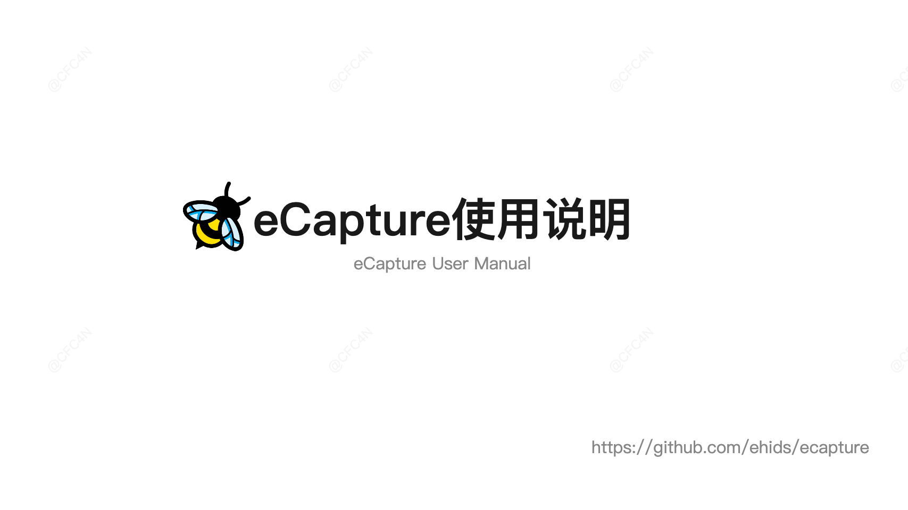

 汉字 | [English](./README.md) 

[](https://github.com/gojue/ecapture)
[](https://github.com/gojue/ecapture)
[](https://github.com/gojue/ecapture/actions/workflows/code-analysis.yml)
[](https://github.com/gojue/ecapture/releases)
[](https://v2.ecapture.cc)
[](https://qm.qq.com/cgi-bin/qm/qr?k=iCu561fq4zdbHVdntQLFV0Xugrnf7Hpv&jump_from=webapi&authKey=YamGv189Cg+KFdQt1Qnsw6GZlpx8BYA+G2WZFezohY4M03V+l0eElZWOhZj/wR/5)

### eCapture(旁观者): 基于eBPF技术实现SSL/TLS加密的明文捕获，无需CA证书。

> [!TIP]
> 支持Linux系统内核x86_64 4.18及以上版本，aarch64 5.5及以上版本；
> 需要ROOT权限或特定的 [Linux capabilities](docs/minimum-privileges.md)；
> 不支持Windows、macOS系统；

----
<!-- MarkdownTOC autolink="true" -->

- [介绍](#介绍)
- [快速上手](#快速上手)
  - [下载](#下载)
    - [ELF可执行文件](#elf可执行文件)
    - [Docker容器镜像](#docker容器镜像)
  - [小试身手](#小试身手)
  - [模块介绍](#模块介绍)
    - [openssl  模块](#openssl--模块)
    - [gotls 模块](#gotls-模块)
    - [其他模块](#其他模块)
  - [使用演示](#使用演示)
- [星标成长曲线](#星标成长曲线)
- [安全与运维](#安全与运维)
- [贡献](#贡献)
- [二次开发](#二次开发)
- [微信公众号](#微信公众号)
<!-- /MarkdownTOC -->
----

# 介绍

eCapture的汉字名字为**旁观者**，即「**当局者迷，旁观者清**」，与其本身功能**旁路、观察**
契合，且发音与英文有相似之处。eCapture使用eBPF `Uprobe`/`Traffic Control`技术，实现各种用户空间/内核空间的数据捕获，无需改动原程序。


# 快速上手

## 下载

### ELF可执行文件

> [!IMPORTANT]
> 支持 Linux/Android的x86_64/aarch64 CPU架构。

下载 [release](https://github.com/gojue/ecapture/releases) 的二进制包，可直接使用。

### Docker容器镜像

> [!TIP]
> 仅支持Linux x86_64/aarch64。

```shell
# 拉取镜像
docker pull gojue/ecapture:latest
# 运行
docker run --rm --privileged=true --net=host -v ${宿主机文件路径}:${容器内路径} gojue/ecapture ARGS
```

> **⚠️ 安全提醒**: `--privileged=true` 会授予容器完整的宿主机访问权限。在生产环境中，建议使用特定的 capabilities 替代。参阅 [最小权限指南](docs/minimum-privileges.md#method-3-docker-with-specific-capabilities)。

## 小试身手


捕获基于Openssl动态链接库加密的网络通讯。

```shell
sudo ecapture tls
```

eCapture 会自动检测系统的 OpenSSL 库并开始捕获明文。当你发起 HTTPS 请求时（如 `curl https://baidu.com`），捕获到的请求和响应将会显示：

```
...
INF module started successfully. moduleName=EBPFProbeOPENSSL
??? UUID:233479_233479_curl_5_1_39.156.66.10:443, Name:HTTPRequest, Type:1, Length:73
GET / HTTP/1.1
Host: baidu.com
Accept: */*
User-Agent: curl/7.81.0
...
```

> 📄 完整的输出示例请参阅 [docs/example-outputs.md](docs/example-outputs.md)。

## 模块介绍
eCapture 有8个模块，分别支持openssl/gnutls/nspr/boringssl/gotls等类库的TLS/SSL加密类库的明文捕获、Bash、Mysql、PostGres软件审计。

* bash 捕获bash命令行的输入输出
* gnutls 捕获基于gnutls类库加密通讯的明文内容
* gotls 捕获使用Golang语言编写的，基于内置crypt类库实现TLS/HTTPS加密通讯的明文内容
* mysqld 捕获Mysqld的SQL查询，适用于数据库审计场景，支持Mysqld 5.6/5.7/8.0等
* nss 捕获基于nss类库加密通讯的明文内容
* postgres 支持postgres 10+的数据库审计，捕获查询语句
* tls 捕获基于Openssl/Boringssl的加密通讯的明文内容，支持Openssl 1.0.x/1.1.x/3.x以及更新版本，支持BoringSSL所有发行版本

你可以通过`ecapture -h`来查看这些自命令列表。

### openssl  模块

执行`sudo ecapture -h`查看详细帮助文档。

eCapture默认查找`/etc/ld.so.conf`文件，查找SO文件的加载目录，并查找`openssl`等动态链接路位置。你也可以通过`--libssl`
参数指定动态链接库路径。

如果目标程序使用静态编译方式，则可以直接将`--libssl`参数设定为该程序的路径。

openssl模块支持3种捕获模式

- pcap/pcapng模式，将捕获的明文数据以pcap-NG格式存储。
- keylog/key模式，保存TLS的握手密钥到文件中。
- text模式，直接捕获明文数据，输出到指定文件中，或者打印到命令行。

#### Pcap 模式

支持了TLS加密的基于TCP的http `1.0/1.1/2.0`应用层协议, 以及基于UDP的 http3 `QUIC`应用层协议。
你可以通过`-m pcap`或`-m pcapng`参数来指定，需要配合`--pcapfile`、`-i`参数使用。其中`--pcapfile`参数的默认值为`ecapture_openssl.pcapng`。
```shell
sudo ecapture tls -m pcap -i eth0 --pcapfile=ecapture.pcapng tcp port 443
```

> 📄 完整的 pcapng 模式输出请参阅 [docs/example-outputs.md](docs/example-outputs.md#tls-module--pcapng-mode)。

将捕获的明文数据包保存为pcapng文件，再使用`Wireshark`打开查看，之后就可以看到明文的网络包了。

#### keylog 模式
你可以通过`-m keylog`或`-m key`参数来指定，需要配合`--keylogfile`参数使用，默认为`ecapture_masterkey.log`。
捕获的openssl TLS的密钥`Master Secret`信息，将保存到`--keylogfile`中。你也可以同时开启`tcpdump`抓包，再使用`Wireshark`打开，设置`Master Secret`路径，查看明文数据包。
```shell
sudo ecapture tls -m keylog -keylogfile=openssl_keylog.log
```

也可以直接使用`tshark`软件实时解密展示。
```shell
tshark -o tls.keylog_file:ecapture_masterkey.log -Y http -T fields -e http.file_data -f "port 443" -i eth0
```

#### text 模式

`sudo ecapture tls -m text ` 将会输出所有的明文数据包。（v0.7.0起，不再捕获SSLKEYLOG信息。）

### gotls 模块
与openssl模块类似。

#### 验证方法：

```shell
cfc4n@vm-server:~$# uname -r
4.18.0-305.3.1.el8.x86_64
cfc4n@vm-server:~$# cat /boot/config-`uname -r` | grep CONFIG_DEBUG_INFO_BTF
CONFIG_DEBUG_INFO_BTF=y
```

#### 启动eCapture
```shell
sudo ecapture gotls --elfpath=/home/cfc4n/go_https_client --hex
```

#### 启动该程序:
确保该程序会触发https请求。
```shell
/home/cfc4n/go_https_client
```

#### 更多帮助
```shell
sudo ecapture gotls -h
```

### 其他模块

eCapture 还支持其他模块，如`bash`、`mysql`、`nss`、`postgres`等，你可以通过`ecapture -h`查看详细帮助文档。

## 使用演示

### 介绍文章

[eCapture：无需CA证书抓https明文通讯](https://mp.weixin.qq.com/s/DvTClH3JmncpkaEfnTQsRg)

### 视频：Linux上使用eCapture

[](https://www.bilibili.com/video/BV1si4y1Q74a "eCapture User Manual")

### 视频：Android上使用eCapture

[](https://www.bilibili.com/video/BV1xP4y1Z7HB "eCapture for Android")

## eCaptureQ 界面程序

[eCaptureQ](https://github.com/gojue/ecaptureq)是 eCapture 的跨平台图形界面客户端，将 eBPF TLS 抓包能力可视化呈现。采用
Rust + Tauri + React
技术栈构建，提供实时响应式界面，无需 CA 证书即可轻松分析加密流量。让复杂的 eBPF 抓包技术变得简单易用。 支持两种模式：

*
* 集成模式：Linux/Android 一体化运行
* 远程模式：Windows/macOS/Linux 客户端连接远程 eCapture 服务

### 其他事件转发项目
[事件转发优秀项目](./EVENT_FORWARD.md)

### 视频演示

https://github.com/user-attachments/assets/c8b7a84d-58eb-4fdb-9843-f775c97bdbfb

🔗 [GitHub 仓库](https://github.com/gojue/ecaptureq)

### Protobuf 协议说明

关于 eCapture/eCaptureQ 使用的 Protobuf 日志模式的详细信息，请参见：

- [protobuf/PROTOCOLS-zh_Hans.md](protobuf/PROTOCOLS-zh_Hans.md)

## 星标成长曲线

[](https://starchart.cc/gojue/ecapture)

# 安全与运维

- [**安全策略**](SECURITY.md) — 漏洞报告流程与支持的版本
- [**最小权限指南**](docs/minimum-privileges.md) — 所需的 Linux capabilities 与最小权限配置
- [**防御与检测**](docs/defense-detection.md) — 如何检测和防御未经授权的使用
- [**性能基准测试**](docs/performance-benchmarks.md) — 性能开销测量方法与预期特征
- [**发布验证**](docs/release-verification.md) — 如何验证发布产物的完整性

# 贡献

参考 [CONTRIBUTING](./CONTRIBUTING.md)的介绍，提交缺陷、补丁、建议等，非常感谢。

# 二次开发
## 自行编译
你可以定制自己想要的功能，比如设定`uprobe`
的偏移地址，用来支持被静态编译的Openssl类库。编译方法可以参考 [编译指南](docs/compilation-zh_Hans.md) 的介绍。

## 动态修改配置
当eCapture运行后，你可以通过HTTP接口动态修改配置，参考[HTTP API 文档](docs/remote-config-update-api-zh_Hans.md)。

## 事件转发
eCapture支持多种事件转发方式，你可以将事件转发至Burp Suite等抓包软件，详情参考[事件转发API 文档](docs/event-forward-api-zh_Hans.md)。

# 微信公众号


## 感谢

本项目获得 [JetBrains IDE](https://www.jetbrains.com) 许可证的支持。感谢 JetBrains 对开源社区的贡献。

