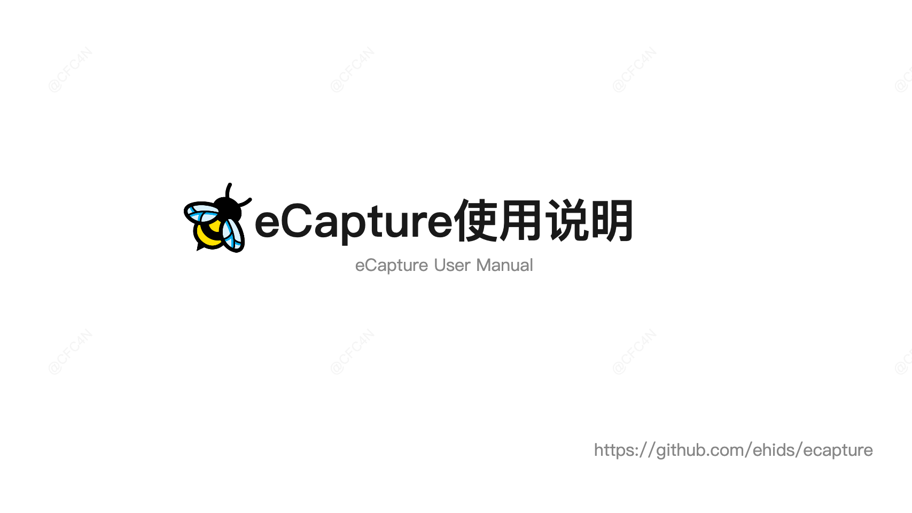

<p align="center">
  
</p>

<p align="center">
  <strong>eCapture（旁观者）</strong><br />
  基于 eBPF 技术捕获 SSL/TLS 明文流量，无需 CA 证书。
</p>

<p align="center">
  <a href="./README.md">English</a> · <strong>汉字</strong><br />
  <a href="https://github.com/gojue/ecapture/actions/workflows/codeql-analysis.yml"></a>
  <a href="https://github.com/gojue/ecapture/releases"></a>
  <a href="https://ecapture.cc"></a>
  <a href="https://qm.qq.com/cgi-bin/qm/qr?k=iCu561fq4zdbHVdntQLFV0Xugrnf7Hpv&amp;jump_from=webapi&amp;authKey=YamGv189Cg+KFdQt1Qnsw6GZlpx8BYA+G2WZFezohY4M03V+l0eElZWOhZj/wR/5"></a>
</p>

<p align="center">
  <a href="https://www.star-history.com/gojue/ecapture">
    <picture>
      <source media="(prefers-color-scheme: dark)" srcset="https://api.star-history.com/badge?repo=gojue/ecapture&amp;type=rank&amp;theme=dark" />
      <source media="(prefers-color-scheme: light)" srcset="https://api.star-history.com/badge?repo=gojue/ecapture&amp;type=rank" />
      
    </picture>
  </a>
  <a href="https://www.star-history.com/gojue/ecapture">
    <picture>
      <source media="(prefers-color-scheme: dark)" srcset="https://api.star-history.com/badge?repo=gojue/ecapture&amp;type=trending&amp;theme=dark" />
      <source media="(prefers-color-scheme: light)" srcset="https://api.star-history.com/badge?repo=gojue/ecapture&amp;type=trending" />
      
    </picture>
  </a>
</p>

> [!IMPORTANT]
> 支持 Linux/Android 系统，x86_64 架构内核 4.18+，aarch64 架构内核 5.5+；内核版本要求按 CPU 架构分别适用。
> 需要 root 权限或特定的 [Linux capabilities](docs/minimum-privileges.md)。
> 不支持 Windows 和 macOS。

----

<!-- MarkdownTOC autolink="true" -->
- [简介](#简介)
- [快速上手](#快速上手)
  - [下载](#下载)
   - [ELF 可执行文件](#elf-可执行文件)
   - [Docker 镜像](#docker-镜像)
 - [快速体验](#快速体验)
  - [模块介绍](#模块介绍)
   - [OpenSSL 模块](#openssl-模块)
   - [GoTLS 模块](#gotls-模块)
    - [其他模块](#其他模块)
  - [使用演示](#使用演示)
- [星标成长曲线](#星标成长曲线)
- [安全与运维](#安全与运维)
- [贡献](#贡献)
- [二次开发](#二次开发)
- [微信公众号](#微信公众号)
<!-- /MarkdownTOC -->

----

# 简介

eCapture 的汉字名字为“旁观者”，寓意“当局者迷，旁观者清”，与其核心能力“旁路观察”相契合，同时也与英文名称在发音上有相似之处。

eCapture 使用 eBPF 的 `uprobe` / `Traffic Control` 等技术，在不修改目标程序的前提下，捕获用户空间和内核空间中的各类数据，适用于 TLS/SSL 明文抓取、命令审计和数据库查询审计等场景。

# 快速上手

## 下载

### ELF 可执行文件

> [!TIP]
> 支持 Linux/Android 的 x86_64 和 aarch64 架构。

可从 [Release](https://github.com/gojue/ecapture/releases) 页面下载对应的二进制包，解压后直接使用：

```shell
sudo ecapture --help
```

### Docker 镜像

> [!TIP]
> 仅支持 Linux。

```shell
# 拉取镜像
docker pull gojue/ecapture:latest

# 运行
docker run --rm --privileged=true --net=host -v ${HOST_PATH}:${CONTAINER_PATH} gojue/ecapture ARGS
```

> **⚠️ 安全提醒**：`--privileged=true` 会授予容器完整的宿主机访问权限。生产环境中，建议优先使用更细粒度的 Linux capabilities。详情请参阅 [最小权限指南](docs/minimum-privileges.md#method-3-docker-with-specific-capabilities)。

See [Docker Hub](https://hub.docker.com/r/gojue/ecapture) for more information.

## 快速体验


下面以捕获基于 OpenSSL 动态链接库加密的网络通讯为例：

```shell
sudo ecapture tls
```

eCapture 会自动检测系统中的 OpenSSL 库并开始抓取明文数据。当你发起 HTTPS 请求，例如 `curl https://baidu.com` 时，抓取到的请求和响应会直接显示出来：

```text
...
INF module started successfully. moduleName=EBPFProbeOPENSSL
??? UUID:233479_233479_curl_5_1_39.156.66.10:443, Name:HTTPRequest, Type:1, Length:73
GET / HTTP/1.1
Host: baidu.com
Accept: */*
User-Agent: curl/7.81.0
...
```

> 📄 更多完整的输出示例，请参阅 [docs/example-outputs.md](docs/example-outputs.md)。

## 模块介绍

eCapture 包含 8 个模块，分别支持对 OpenSSL、GnuTLS、NSS/NSPR、BoringSSL 和 GoTLS 等 TLS/SSL 加密库的明文捕获，同时支持 Bash、MySQL 和 PostgreSQL 的审计与分析。

* bash：捕获 bash 命令行输入与执行内容
* zsh：捕获 zsh 命令行输入与执行内容
* gnutls：捕获基于 GnuTLS 加密通信的明文内容
* gotls：捕获 Go 语言程序中基于内置 TLS/HTTPS 实现的明文通信
* mysqld：捕获 MySQL 查询语句，支持 MySQL 5.6 / 5.7 / 8.0 及 MariaDB
* nss：捕获基于 NSS/NSPR 加密通信的明文内容
* postgres：捕获 PostgreSQL 10+ 的查询语句
* tls：捕获基于 OpenSSL/BoringSSL 的明文 TLS/SSL 流量，支持 OpenSSL 1.0.x / 1.1.x / 3.x 及更高版本，以及 BoringSSL 的所有发行版本

你可以通过 `ecapture -h` 查看各个子命令列表。

### OpenSSL 模块

eCapture 默认会读取 `/etc/ld.so.conf` 中的库加载目录并定位 `openssl` 等动态链接库的位置。你也可以通过 `--libssl` 参数显式指定动态库路径。

如果目标程序使用静态编译方式，则可以直接将 `--libssl` 参数设置为该程序的路径。

OpenSSL 模块支持三种捕获模式：

- `pcap` / `pcapng`：将捕获到的明文数据保存为 `pcap-NG` 格式。
- `keylog` / `key`：将 TLS 握手密钥保存到文件中。
- `text`：直接抓取明文数据，并输出到指定文件或命令行终端。

#### Pcap 模式

支持基于 TCP 的 HTTP `1.0/1.1/2.0` 以及基于 UDP 的 HTTP/3 (`QUIC`) 流量抓取。

你可以通过 `-m pcap` 或 `-m pcapng` 参数指定抓包模式，并配合 `--pcapfile` 和 `-i` 参数使用。其中 `--pcapfile` 的默认值为 `ecapture_openssl.pcapng`。

```shell
sudo ecapture tls -m pcap -i eth0 --pcapfile=ecapture.pcapng tcp port 443
```

该命令会将捕获到的明文数据包保存为 pcapng 文件，可使用 Wireshark 打开进行分析。

> 📄 完整的 pcapng 模式输出示例，请参阅 [docs/example-outputs.md](docs/example-outputs.md#tls-module--pcapng-mode)。

#### Keylog 模式

你可以通过 `-m keylog` 或 `-m key` 参数指定密钥导出模式，并配合 `--keylogfile` 参数使用，默认输出文件为 `ecapture_masterkey.log`。

捕获到的 OpenSSL TLS `Master Secret` 信息会保存到 `--keylogfile` 中。你也可以同时开启 `tcpdump` 抓包，然后使用 Wireshark 打开对应 pcap 文件，并设置 `Master Secret` 路径，即可解密并查看明文数据包。

```shell
sudo ecapture tls -m keylog -keylogfile=openssl_keylog.log
```

也可以直接使用 `tshark` 进行实时解密和展示：

```shell
tshark -o tls.keylog_file:ecapture_masterkey.log -Y http -T fields -e http.file_data -f "port 443" -i eth0
```

#### Text 模式

```shell
sudo ecapture tls -m text
```

该命令会输出所有明文数据包。

### GoTLS 模块

该模块与 OpenSSL 模块的原理相似。

#### 启动方式

Step 1：

```shell
sudo ecapture gotls --elfpath=/home/cfc4n/go_https_client --hex
```

Step 2：

```shell
/home/cfc4n/go_https_client
```

#### 更多帮助

```shell
sudo ecapture gotls -h
```

### 其他模块

eCapture 还支持其他模块，例如 `bash`、`mysqld`、`nss`、`postgres` 等，更多详细信息可通过 `ecapture -h` 查看。

## 使用演示

### 介绍文章

[eCapture：无需 CA 证书抓取 HTTPS 明文通讯](https://mp.weixin.qq.com/s/DvTClH3JmncpkaEfnTQsRg)

### 视频：Linux 上使用 eCapture

[](https://www.bilibili.com/video/BV1si4y1Q74a "eCapture User Manual")

### 视频：Android 上使用 eCapture

[](https://www.bilibili.com/video/BV1xP4y1Z7HB "eCapture for Android")

## eCaptureQ 图形界面程序

[eCaptureQ](https://github.com/gojue/ecaptureq) 是 eCapture 的跨平台图形界面客户端，用于可视化展示 eBPF TLS 抓包能力。它基于 Rust + Tauri + React 构建，提供实时响应式界面，无需 CA 证书即可轻松分析加密流量，降低了复杂 eBPF 抓包技术的使用门槛。

它支持两种模式：

* 集成模式：Linux/Android 一体化运行
* 远程模式：Windows/macOS/Linux 客户端连接远程 eCapture 服务

### 事件转发项目

[事件转发相关项目](./EVENT_FORWARD.md)

### 视频演示

https://github.com/user-attachments/assets/c8b7a84d-58eb-4fdb-9843-f775c97bdbfb

🔗 [GitHub 仓库](https://github.com/gojue/ecaptureq)

### Protobuf 协议说明

有关 eCapture/eCaptureQ 使用的 Protobuf 日志格式说明，详见：

- [protobuf/PROTOCOLS-zh_Hans.md](protobuf/PROTOCOLS-zh_Hans.md)

## 星标成长曲线

<a href="https://www.star-history.com/?repos=gojue%2Fecapture&type=date&legend=top-left">
 <picture>
   <source media="(prefers-color-scheme: dark)" srcset="https://api.star-history.com/chart?repos=gojue/ecapture&type=date&theme=dark&legend=top-left" />
   <source media="(prefers-color-scheme: light)" srcset="https://api.star-history.com/chart?repos=gojue/ecapture&type=date&legend=top-left" />
   
 </picture>
</a>

# 安全与运维

- [**安全策略**](SECURITY.md) — 漏洞报告流程与支持版本说明
- [**最小权限指南**](docs/minimum-privileges.md) — 所需的 Linux capabilities 与最小权限配置
- [**防御与检测**](docs/defense-detection.md) — 如何检测和防御未经授权的使用
- [**性能基准测试**](docs/performance-benchmarks.md) — 可重复的性能开销与事件丢失测量方法
- [**发布验证**](docs/release-verification.md) — 如何验证发布产物的完整性

# 贡献

请参考 [CONTRIBUTING](./CONTRIBUTING.md) 了解提交补丁、问题反馈和贡献流程，感谢您的支持与参与。

# 二次开发

## 自行编译

你可以按需定制功能，例如设置 `uprobe` 的偏移地址，以支持静态编译的 OpenSSL 库。编译方法可参考 [编译指南](docs/compilation-zh_Hans.md)。

## 动态修改配置

当 eCapture 运行后，你可以通过 HTTP 接口动态修改配置，详情请参考 [HTTP API 文档](docs/remote-config-update-api-zh_Hans.md)。

## 事件转发

eCapture 支持多种事件转发方式，你可以将事件转发到 Burp Suite 等抓包工具。详情请参考 [事件转发 API 文档](docs/event-forward-api-zh_Hans.md)。

# 微信公众号


