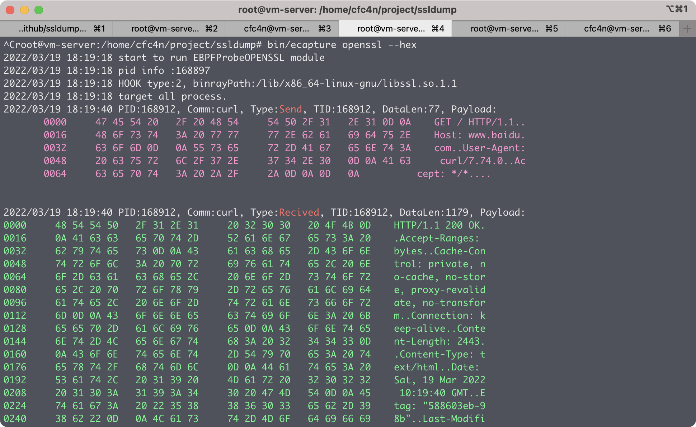

# ecapture 介绍
eBPF HOOK uprobe实现的各种用户态进程的数据捕获，无需改动原程序。
* SSL/HTTPS数据导出功能，针对HTTPS的数据包抓取，不需要导入CA证书。
* bash的命令捕获，HIDS的bash命令监控解决方案。
* mysql query等数据库的数据库审计解决方案。

# 演示

### 截图


### 视频
[https://v.qq.com/txp/iframe/player.html?vid=m33278fdqt8](https://v.qq.com/txp/iframe/player.html?vid=m33278fdqt8)


# 使用
## 直接运行
下载 [release](https://github.com/ehids/ecapture/releases) 的二进制包，可直接使用。

系统配置要求
* 系统linux kernel版本必须高于4.18。
* 开启BTF [BPF Type Format (BTF)](https://www.kernel.org/doc/html/latest/bpf/btf.html) 支持。

### 
验证方法：
```shell
cfc4n@vm-server:~$# uname -r
4.18.0-305.3.1.el8.x86_64
cfc4n@vm-server:~$# cat /boot/config-`uname -r` | grep CONFIG_DEBUG_INFO_BTF
CONFIG_DEBUG_INFO_BTF=y
```

### openssl的无证书抓包 openssl
执行任意https网络请求即可使用。
```shell
curl https://www.qq.com
```

## 注意
已知centos 8.2的系统上，wget的网络行为无法获取，原因为wget没有使用openssl的so动态链接库`libssl.so`，而是`/lib64/libgnutls.so.30`，稍后支持。

### bash的shell捕获
```shell
ps -ef | grep foo
```

# 微信公众号


## 自行编译
自行编译对编译环境有要求，参考**原理**章节的介绍。

# 原理

## eBPF技术
参考[ebpf](https://ebpf.io)官网的介绍

## uprobe HOOK

### https的ssl hook 
本项目hook了`/lib/x86_64-linux-gnu/libssl.so.1.1`的`SSL_write`、`SSL_read`函数的返回值，拿到明文信息，通过ebpf map传递给用户进程。
```go
Probes: []*manager.Probe{
    {
        Section:          "uprobe/SSL_write",
        EbpfFuncName:     "probe_entry_SSL_write",
        AttachToFuncName: "SSL_write",
        //UprobeOffset:     0x386B0,
        BinaryPath: "/lib/x86_64-linux-gnu/libssl.so.1.1",
    },
    {
        Section:          "uretprobe/SSL_write",
        EbpfFuncName:     "probe_ret_SSL_write",
        AttachToFuncName: "SSL_write",
        //UprobeOffset:     0x386B0,
        BinaryPath: "/lib/x86_64-linux-gnu/libssl.so.1.1",
    },
    {
        Section:          "uprobe/SSL_read",
        EbpfFuncName:     "probe_entry_SSL_read",
        AttachToFuncName: "SSL_read",
        //UprobeOffset:     0x38380,
        BinaryPath: "/lib/x86_64-linux-gnu/libssl.so.1.1",
    },
    {
        Section:          "uretprobe/SSL_read",
        EbpfFuncName:     "probe_ret_SSL_read",
        AttachToFuncName: "SSL_read",
        //UprobeOffset:     0x38380,
        BinaryPath: "/lib/x86_64-linux-gnu/libssl.so.1.1",
    },
    /**/
},
```
### bash的readline hook
hook了`/bin/bash`的`readline`函数。

# 编译方法
针对个别程序使用的openssl类库是静态编译，也可以自行修改源码实现。若函数名不在符号表里，也可以自行反编译找到函数的offset偏移地址，填写到`UprobeOffset`属性上，进行编译。
笔者环境`ubuntu 21.04`， linux kernel 5.10以上通用。
**推荐使用`UBUNTU 21.04`版本的linux测试。**

## 工具链版本
* gcc 10.3.0
* clang 12.0.0  
* cmake 3.18.4
* clang backend: llvm 12.0.0   

### 最低要求 (笔者未验证)
* gcc 5.1 以上
* clang 9
* cmake 3.14


## 编译
```shell
git clone git@github.com:ehids/ecapture.git
cd ecapture
make
bin/ecapture
```
### 提醒
首次编译时，需要先下载 `go get -d github.com/shuLhan/go-bindata/cmd/go-bindata`

# 联系我们

##  技术交流群


# 参考资料
[BPF Portability and CO-RE](https://facebookmicrosites.github.io/bpf/blog/2020/02/19/bpf-portability-and-co-re.html)
[ebpfmanager v0.2.2](https://github.com/ehids/ebpfmanager)