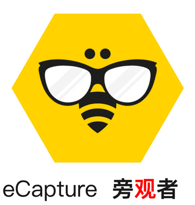
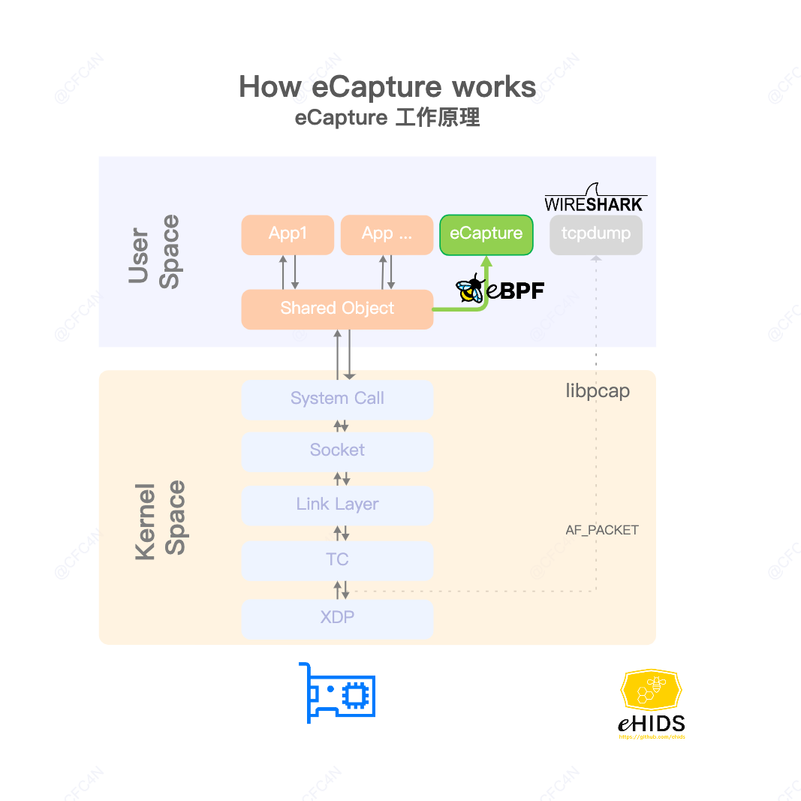
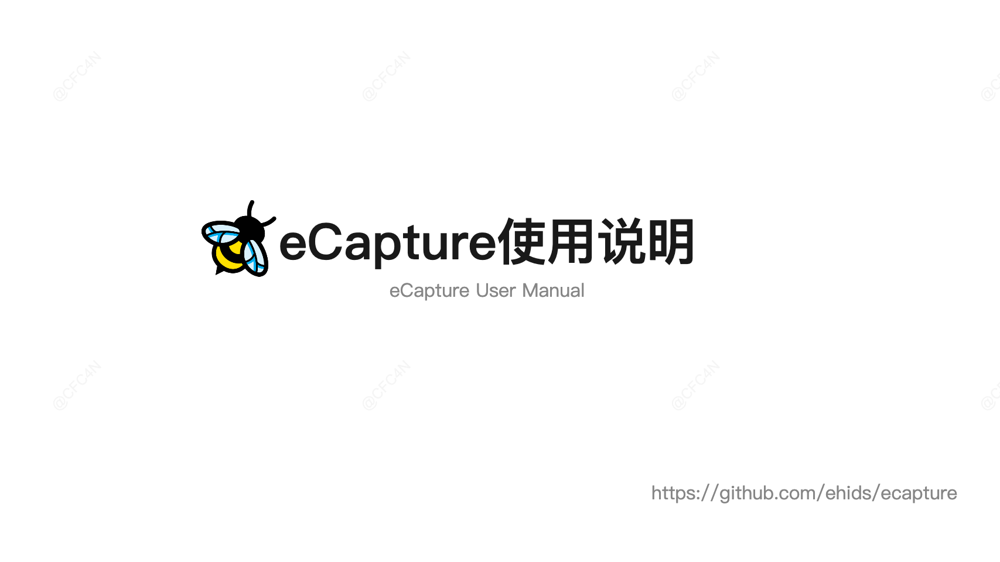

[中文介绍](./README_CN.md) | English | [日本語](./README_JA.md)

[](https://github.com/gojue/ecapture)
[](https://github.com/gojue/ecapture)
[](https://github.com/gojue/ecapture/actions/workflows/code-analysis.yml)
[](https://github.com/gojue/ecapture/releases)

### eCapture(旁观者):  capture SSL/TLS text content without CA cert Using eBPF.

> **Note**
>
> Supports Linux/Android kernel versions x86_64 4.18 and above, **aarch64 5.5** and above.
> Does not support Windows and macOS system.
----

#  How eCapture works



* SSL/TLS plaintext capture, support openssl\libressl\boringssl\gnutls\nspr(nss) libraries.
* GoTLS plaintext support go tls library, which refers to encrypted communication in https/tls programs written in the golang language.
* bash audit, capture bash command for Host Security Audit.
* mysql query SQL audit, support mysqld 5.6\5.7\8.0, and mariadDB.

# eCapture Architecture


# eCapture User Manual

[](https://www.youtube.com/watch?v=CoDIjEQCvvA "eCapture User Manual")

# Getting started

## use ELF binary file

Download ELF zip file [release](https://github.com/gojue/ecapture/releases) , unzip and use by
command `./ecapture --help`.

* Linux kernel version >= 4.18 is required.
* Enable BTF [BPF Type Format (BTF)](https://www.kernel.org/doc/html/latest/bpf/btf.html)  (Optional, 2022-04-17)

## Command line options

> **Note**
>
> Need ROOT permission.
>
eCapture search `/etc/ld.so.conf` file default, to search load directories of  `SO` file, and search `openssl` shard
libraries location. or you can use `--libssl`
flag to set shard library path.

If target program is compile statically, you can set program path as `--libssl` flag value directly。

### Pcapng result

`./ecapture tls -i eth0 -w pcapng -p 443` capture plaintext packets save as pcapng file, use `Wireshark` read it
directly.

### plaintext result

`./ecapture tls` will capture all plaintext context ,output to console, and capture `Master Secret` of `openssl TLS`
save to `ecapture_masterkey.log`. You can also use `tcpdump` to capture raw packet,and use `Wireshark` to read them
with `Master Secret` settings.

>

### check your server BTF config：

```shell
cfc4n@vm-server:~$# uname -r
4.18.0-305.3.1.el8.x86_64
cfc4n@vm-server:~$# cat /boot/config-`uname -r` | grep CONFIG_DEBUG_INFO_BTF
CONFIG_DEBUG_INFO_BTF=y
```

### tls command

capture tls text context.
Step 1:
```shell
./ecapture tls --hex
```

Step 2:
```shell
curl https://github.com
```

### libressl&boringssl
```shell
# for installed libressl, libssl.so.52 is the dynamic ssl lib
vm@vm-server:~$ ldd /usr/local/bin/openssl
	linux-vdso.so.1 (0x00007ffc82985000)
	libssl.so.52 => /usr/local/lib/libssl.so.52 (0x00007f1730f9f000)
	libcrypto.so.49 => /usr/local/lib/libcrypto.so.49 (0x00007f1730d8a000)
	libc.so.6 => /lib/x86_64-linux-gnu/libc.so.6 (0x00007f1730b62000)
	/lib64/ld-linux-x86-64.so.2 (0x00007f17310b2000)

# use the libssl to config the libssl.so path
vm@vm-server:~$ sudo ./ecapture tls --libssl="/usr/local/lib/libssl.so.52" --hex

# in another terminal, use the command, then type some string, watch the output of ecapture
vm@vm-server:~$ /usr/local/bin/openssl s_client -connect github.com:443

# for installed boringssl, usage is the same
/path/to/bin/bssl s_client -connect github.com:443
```

### bash command
capture bash command.
```shell
ps -ef | grep foo
```

# What's eBPF
[eBPF](https://ebpf.io)

# How to compile
Linux Kernel: >= 4.18.

## Tools 
* golang 1.18 or newer
* clang 9.0 or newer
* cmake 3.18.4 or newer
* clang backend: llvm 9.0 or newer
* kernel config:CONFIG_DEBUG_INFO_BTF=y (Optional, 2022-04-17)

## command

### ubuntu
If you are using Ubuntu 20.04 or later versions, you can use a single command to complete the initialization of the compilation environment.
```shell
/bin/bash -c "$(curl -fsSL https://raw.githubusercontent.com/gojue/ecapture/master/builder/init_env.sh)"
```
### other Linux
In addition to the software listed in the 'Toolchain Version' section above, the following software is also required for the compilation environment. Please install it yourself.
* linux-tools-common
* linux-tools-generic
* pkgconf
* libelf-dev

**Clone the repository code and compile it**
```shell
git clone git@github.com:gojue/ecapture.git
cd ecapture
make
bin/ecapture
```
## compile without BTF
eCapture support BTF disabled with command `make nocore` to compile at 2022/04/17. It can work normally even on Linux systems that do not support BTF.
```shell
make nocore
bin/ecapture --help
```


# Contributing
See [CONTRIBUTING](./CONTRIBUTING.md) for details on submitting patches and the contribution workflow.
