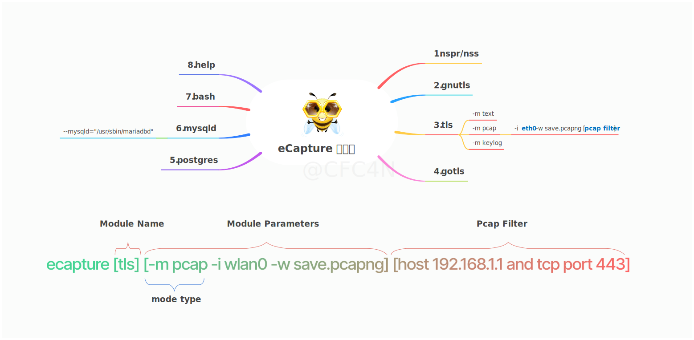

[汉字](README-zh_Hans.md) | English 

[](https://github.com/gojue/ecapture)
[](https://github.com/gojue/ecapture)
[](https://github.com/gojue/ecapture/actions/workflows/code-analysis.yml)
[](https://github.com/gojue/ecapture/releases)

### eCapture(旁观者): capture SSL/TLS text content without a CA certificate using eBPF.

> [!IMPORTANT]  
> Supports Linux/Android kernel versions x86_64 4.18 and above, **aarch64 5.5** and above.
> Need ROOT permission or specific [Linux capabilities](docs/minimum-privileges.md).
> Does not support Windows and macOS system.

----

<!-- MarkdownTOC autolink="true" -->
- [Introduction](#introduction)
- [Getting started](#getting-started)
  - [Download](#download)
    - [ELF binary file](#elf-binary-file)
    - [Docker image](#docker-image)
  - [Capture openssl text content.](#capture-openssl-text-content)
  - [Modules](#modules)
    - [OpenSSL Module](#openssl-module)
    - [GoTLS Module](#gotls-module)
    - [Other Modules](#bash-module)
  - [Videos](#videos)
- [Security & Operations](#security--operations)
- [Contributing](#contributing)
- [Compilation](#compilation)
<!-- /MarkdownTOC -->

# Introduction

* SSL/TLS plaintext capture, support openssl\libressl\boringssl\gnutls\nspr(nss) libraries.
* GoTLS plaintext support go tls library, which refers to encrypted communication in https/tls programs written in the golang language.
* Bash audit, capture bash command for Host Security Audit.
* Zsh audit, capture zsh command for Host Security Audit.
* MySQL query SQL audit, support mysqld 5.6\5.7\8.0, and MariaDB.



# Getting started

## Download

### ELF binary file

> [!TIP]
> support Linux/Android x86_64/aarch64.

Download ELF zip file [release](https://github.com/gojue/ecapture/releases) , unzip and use by
command `sudo ecapture --help`.

### Docker image

> [!TIP]
> Linux only.

```shell
# pull docker image
docker pull gojue/ecapture:latest
# run
docker run --rm --privileged=true --net=host -v ${HOST_PATH}:${CONTAINER_PATH} gojue/ecapture ARGS
```

> **⚠️ Security Note**: `--privileged=true` grants full host access. For production use, consider specific capabilities instead. See [Minimum Privileges Guide](docs/minimum-privileges.md#method-3-docker-with-specific-capabilities).

see [Docker Hub](https://hub.docker.com/r/gojue/ecapture) for more information.

## Capture openssl text content.

```shell
sudo ecapture tls
```

eCapture will automatically detect the system's OpenSSL library and start capturing plaintext. When you make an HTTPS request (e.g., `curl https://google.com`), the captured request and response will be displayed:

```
...
INF module started successfully. moduleName=EBPFProbeOPENSSL
??? UUID:233851_233851_curl_5_1_172.16.71.1:51837, Name:HTTP2Request, Type:2, Length:304
header field ":method" = "GET"
header field ":path" = "/"
header field ":authority" = "google.com"
...
```

> 📄 For complete output examples, see [docs/example-outputs.md](docs/example-outputs.md).

## Modules
The eCapture tool comprises 8 modules that respectively support plaintext capture for TLS/SSL encryption libraries like OpenSSL, GnuTLS, NSPR, BoringSSL, and GoTLS. Additionally, it facilitates software audits for Bash, MySQL, and PostgreSQL applications.
* bash		capture bash command
* zsh		capture zsh command
* gnutls	capture gnutls text content without CA cert for gnutls libraries.
* gotls		Capturing plaintext communication from Golang programs encrypted with TLS/HTTPS.
* mysqld	capture sql queries from mysqld 5.6/5.7/8.0 .
* nss		capture nss/nspr encrypted text content without CA cert for nss/nspr libraries.
* postgres	capture sql queries from postgres 10+.
* tls		use to capture tls/ssl text content without CA cert. (Support openssl 1.0.x/1.1.x/3.0.x or newer).
  You can use `ecapture -h` to view the list of subcommands.

### OpenSSL Module

eCapture search `/etc/ld.so.conf` file default, to search load directories of  `SO` file, and search `openssl` shard
libraries location. or you can use `--libssl`
flag to set shard library path.

If target program is compile statically, you can set program path as `--libssl` flag value directly。

The OpenSSL module supports three capture modes:

- `pcap`/`pcapng` mode stores captured plaintext data in `pcap-NG` format.
- `keylog`/`key` mode saves the TLS handshake keys to a file.
- `text` mode directly captures plaintext data, either outputting to a specified file or printing to the command line.

#### Pcap Mode

Supported TLS encrypted http `1.0/1.1/2.0` over TCP, and http3 `QUIC` protocol over UDP.
You can specify `-m pcap` or `-m pcapng` and use it in conjunction with `--pcapfile` and `-i` parameters. The default value for `--pcapfile` is `ecapture_openssl.pcapng`.

```shell
sudo ecapture tls -m pcap -i eth0 --pcapfile=ecapture.pcapng tcp port 443
```

This command saves captured plaintext data packets as a pcapng file, which can be viewed using `Wireshark`.

> 📄 For complete pcapng mode output, see [docs/example-outputs.md](docs/example-outputs.md#tls-module--pcapng-mode).

#### Keylog Mode

You can specify `-m keylog` or `-m key` and use it in conjunction with the `--keylogfile` parameter, which defaults to `ecapture_masterkey.log`.

The captured OpenSSL TLS `Master Secret` information is saved to `--keylogfile`. You can also enable `tcpdump` packet capture and then use `Wireshark` to open the file and set the `Master Secret` path to view plaintext data packets.

```shell
sudo ecapture tls -m keylog -keylogfile=openssl_keylog.log
```

You can also directly use the `tshark` software for real-time decryption and display:

```shell
tshark -o tls.keylog_file:ecapture_masterkey.log -Y http -T fields -e http.file_data -f "port 443" -i eth0
```

#### Text Mode

`sudo ecapture tls -m text` will output all plaintext data packets. (Starting from v0.7.0, it no longer captures
SSLKEYLOG information.)

### GoTLS Module

Similar to the OpenSSL module.

#### gotls command

capture tls text context.

Step 1:
```shell
sudo ecapture gotls --elfpath=/home/cfc4n/go_https_client --hex
```

Step 2:
```shell
/home/cfc4n/go_https_client
```

#### more help
```shell
sudo ecapture gotls -h
```

### Other Modules

such as `bash\mysqld\postgres` modules, you can use `ecapture -h` to view the list of subcommands.

## Videos

* Youtube video: [How to use eCapture v0.1.0](https://www.youtube.com/watch?v=CoDIjEQCvvA "eCapture User Manual")
* [eCapture:supports capturing plaintext of Golang TLS/HTTPS traffic](https://medium.com/@cfc4ncs/ecapture-supports-capturing-plaintext-of-golang-tls-https-traffic-f16874048269)


## eCaptureQ GUI Application

[eCaptureQ](https://github.com/gojue/ecaptureq) is a cross-platform graphical user interface client for eCapture,
visualizing eBPF TLS capture
capabilities. Built using the Rust + Tauri + React technology stack, it provides a real-time, responsive interface,
enabling easy analysis of encrypted traffic without the need for CA certificates. It simplifies complex eBPF capture
techniques, making them easy to use. Supports two modes:

* Integrated Mode: Unified Linux/Android execution
* Remote Mode: Windows/macOS/Linux client connects to a remote eCapture service

### Event Forwarding
[Event Forwarding Projects](./EVENT_FORWARD.md)

### Video Demonstration

https://github.com/user-attachments/assets/c8b7a84d-58eb-4fdb-9843-f775c97bdbfb

🔗 [GitHub Repository](https://github.com/gojue/ecaptureq)

### Protobuf Protocols

For details of the Protobuf log schema used by eCapture/eCaptureQ, see:

- [protobuf/PROTOCOLS.md](./protobuf/PROTOCOLS.md)

## Stargazers over time
[](https://starchart.cc/gojue/ecapture)

# Security & Operations

- [**Security Policy**](SECURITY.md) — Vulnerability reporting and supported versions
- [**Minimum Privileges**](docs/minimum-privileges.md) — Required Linux capabilities and least-privilege configuration
- [**Defense & Detection**](docs/defense-detection.md) — How to detect and defend against unauthorized usage
- [**Performance Benchmarks**](docs/performance-benchmarks.md) — Overhead measurement methodology and expected characteristics
- [**Release Verification**](docs/release-verification.md) — How to verify the integrity of release artifacts

# Contributing
See [CONTRIBUTING](./CONTRIBUTING.md) for details on submitting patches and the contribution workflow.

# Compilation
## Custom Compilation

You can customize the features you want, such as setting the offset address for `uprobe` to support statically compiled OpenSSL libraries. Refer to the [compilation guide](./docs/compilation.md) for compilation instructions.

## Configurations Remote Update

After eCapture is running, you can dynamically modify the configurations through HTTP interfaces. Refer to the [HTTP API Documentation](./docs/remote-config-update-api.md).

## Event Forwarding

eCapture supports multiple event forwarding methods. You can forward events to packet capture software such as Burp Suite. For details, refer to the [Event Forwarding API Documentation](./docs/event-forward-api.md).

## Acknowledgements

This project is supported by a [JetBrains IDE](https://www.jetbrains.com) license. We thank JetBrains for their
contributions to the open-source community.


