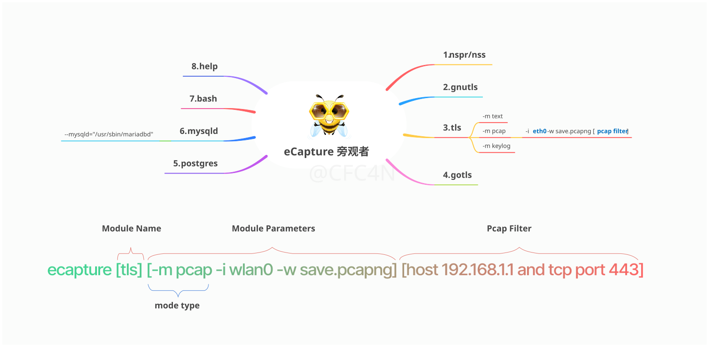

<p align="center">
  
</p>

<p align="center">
  <strong>eCapture (旁观者)</strong><br />
  Capture SSL/TLS plaintext with eBPF—no MITM proxy or custom CA installation.
</p>

<p align="center">
  <strong>English</strong> · <a href="./README-zh_Hans.md">汉字</a><br />
  <a href="https://github.com/gojue/ecapture/actions/workflows/codeql-analysis.yml"></a>
  <a href="https://github.com/gojue/ecapture/releases"></a>
  <a href="https://ecapture.cc"></a>
</p>

<p align="center">
  <a href="https://www.star-history.com/gojue/ecapture">
    <picture>
      <source media="(prefers-color-scheme: dark)" srcset="https://api.star-history.com/badge?repo=gojue/ecapture&amp;type=rank&amp;theme=dark" />
      <source media="(prefers-color-scheme: light)" srcset="https://api.star-history.com/badge?repo=gojue/ecapture&amp;type=rank" />
      
    </picture>
  </a>
  <a href="https://www.star-history.com/gojue/ecapture">
    <picture>
      <source media="(prefers-color-scheme: dark)" srcset="https://api.star-history.com/badge?repo=gojue/ecapture&amp;type=trending&amp;theme=dark" />
      <source media="(prefers-color-scheme: light)" srcset="https://api.star-history.com/badge?repo=gojue/ecapture&amp;type=trending" />
      
    </picture>
  </a>
</p>

> [!IMPORTANT]
> Supports Linux and Android on x86_64 (kernel 4.18+) and aarch64 (kernel **5.5+**). The kernel requirement applies per CPU architecture for both Linux and Android.
> Requires root privileges or specific [Linux capabilities](docs/minimum-privileges.md).
> Does not support Windows or macOS.

----

<!-- MarkdownTOC autolink="true" -->
- [Introduction](#introduction)
- [Getting started](#getting-started)
  - [Download](#download)
    - [ELF binary file](#elf-binary-file)
    - [Docker image](#docker-image)
  - [Capture OpenSSL plaintext data](#capture-openssl-plaintext-data)
  - [Modules](#modules)
    - [OpenSSL module](#openssl-module)
    - [GoTLS module](#gotls-module)
    - [Other modules](#other-modules)
  - [Videos](#videos)
- [Star History](#star-history)
- [Security & operations](#security--operations)
- [Contributing](#contributing)
- [Compilation](#compilation)
<!-- /MarkdownTOC -->

# Introduction

* Captures plaintext TLS/SSL traffic from OpenSSL, LibreSSL, BoringSSL, GnuTLS, and NSS/NSPR libraries.
* Supports plaintext capture for Go TLS programs, including HTTPS/TLS traffic in Go applications.
* Audits bash and zsh command history for host security monitoring.
* Audits MySQL queries and supports MySQL 5.6/5.7/8.0 and MariaDB.



# Getting started

## Download

### ELF binary file

> [!TIP]
> Supports Linux/Android on x86_64 and aarch64.

Download the ELF binary package from the [releases page](https://github.com/gojue/ecapture/releases), extract it, and run:

```shell
sudo ecapture --help
```

### Docker image

> [!TIP]
> Linux only.

```shell
# Pull the Docker image
docker pull gojue/ecapture:latest

# Run it
docker run --rm --privileged=true --net=host -v ${HOST_PATH}:${CONTAINER_PATH} gojue/ecapture ARGS
```

> **⚠️ Security note**: `--privileged=true` grants full host access. For production use, prefer specific capabilities instead. See the [Minimum Privileges Guide](docs/minimum-privileges.md#method-3-docker-with-specific-capabilities).

See [Docker Hub](https://hub.docker.com/r/gojue/ecapture) for more information.

## Capture OpenSSL plaintext data

```shell
sudo ecapture tls
```

eCapture automatically detects the system's OpenSSL library and starts capturing plaintext traffic. When you make an HTTPS request, such as `curl https://google.com`, the captured request and response are displayed:

```
...
INF module started successfully. moduleName=EBPFProbeOPENSSL
??? UUID:233851_233851_curl_5_1_172.16.71.1:51837, Name:HTTP2Request, Type:2, Length:304
header field ":method" = "GET"
header field ":path" = "/"
header field ":authority" = "google.com"
...
```

> 📄 For complete output examples, see [docs/example-outputs.md](docs/example-outputs.md).

## Modules

The eCapture tool includes 8 modules that can capture plaintext data from TLS/SSL libraries such as OpenSSL, GnuTLS, NSS/NSPR, BoringSSL, and GoTLS. It also supports auditing commands and queries from Bash, MySQL, and PostgreSQL applications.

* bash: captures bash commands
* zsh: captures zsh commands
* gnutls: captures plaintext from GnuTLS libraries without needing a CA certificate
* gotls: captures plaintext communication from Go programs using TLS/HTTPS
* mysqld: captures SQL queries from MySQL 5.6/5.7/8.0 and MariaDB
* nss: captures plaintext from NSS/NSPR libraries without needing a CA certificate
* postgres: captures SQL queries from PostgreSQL 10+
* tls: captures plaintext TLS/SSL traffic without a CA certificate (supports OpenSSL 1.0.x/1.1.x/3.0.x and newer)

You can use `ecapture -h` to view the full list of subcommands.

### OpenSSL module

eCapture searches the default library paths from `/etc/ld.so.conf` to locate shared libraries and detect the OpenSSL library location. You can also set the library path explicitly with the `--libssl` flag.

If the target program is statically linked, you can set the program path directly as the value of the `--libssl` flag.

The OpenSSL module supports three capture modes:

- `pcap`/`pcapng` mode stores captured plaintext data in `pcap-NG` format.
- `keylog`/`key` mode saves TLS handshake keys to a file.
- `text` mode captures plaintext data directly, either writing it to a file or printing it to the console.

#### Pcap mode

Supports TLS-encrypted HTTP `1.0/1.1/2.0` over TCP and HTTP/3 (QUIC) over UDP.

You can specify `-m pcap` or `-m pcapng` together with `--pcapfile` and `-i`. The default value of `--pcapfile` is `ecapture_openssl.pcapng`.

```shell
sudo ecapture tls -m pcap -i eth0 --pcapfile=ecapture.pcapng tcp port 443
```

This command saves captured plaintext packets as a pcapng file, which can be opened with Wireshark.

> 📄 For complete pcapng mode output, see [docs/example-outputs.md](docs/example-outputs.md#tls-module--pcapng-mode).

#### Keylog mode

You can specify `-m keylog` or `-m key` together with the `--keylogfile` option. The default output file is `ecapture_masterkey.log`.

The captured OpenSSL TLS master secret is saved to `--keylogfile`. You can also enable `tcpdump` capture and then open the file in Wireshark, setting the master secret path to view plaintext packets.

```shell
sudo ecapture tls -m keylog -keylogfile=openssl_keylog.log
```

You can also use `tshark` for real-time decryption and display:

```shell
tshark -o tls.keylog_file:ecapture_masterkey.log -Y http -T fields -e http.file_data -f "port 443" -i eth0
```

#### Text mode

```shell
sudo ecapture tls -m text
```

This outputs all plaintext data packets.

### GoTLS module

Similar to the OpenSSL module.

#### `gotls` command

Capture TLS plaintext data.

Step 1:

```shell
sudo ecapture gotls --elfpath=/home/cfc4n/go_https_client --hex
```

Step 2:

```shell
/home/cfc4n/go_https_client
```

#### More help

```shell
sudo ecapture gotls -h
```

### Other modules

Modules such as `bash`, `mysqld`, and `postgres` can also be used. You can view the full list with `ecapture -h`.

## Videos

* YouTube video: [How to use eCapture v0.1.0](https://www.youtube.com/watch?v=CoDIjEQCvvA "eCapture User Manual")
* [eCapture: supports capturing plaintext of Go TLS/HTTPS traffic](https://medium.com/@cfc4ncs/ecapture-supports-capturing-plaintext-of-golang-tls-https-traffic-f16874048269)

## eCaptureQ GUI application

[eCaptureQ](https://github.com/gojue/ecaptureq) is a cross-platform graphical client for eCapture that visualizes eBPF-based TLS capture capabilities. Built with Rust + Tauri + React, it provides a responsive, real-time interface for analyzing encrypted traffic without needing a CA certificate. It simplifies complex eBPF capture workflows and makes them easier to use.

It supports two modes:

* Integrated mode: unified Linux/Android execution
* Remote mode: Windows/macOS/Linux clients connect to a remote eCapture service

### Event forwarding

[Event forwarding projects](./EVENT_FORWARD.md)

### Video demonstration

https://github.com/user-attachments/assets/c8b7a84d-58eb-4fdb-9843-f775c97bdbfb

🔗 [GitHub repository](https://github.com/gojue/ecaptureq)

### Protobuf protocols

For details of the Protobuf log schema used by eCapture/eCaptureQ, see:

- [protobuf/PROTOCOLS.md](./protobuf/PROTOCOLS.md)

## Star History

<a href="https://www.star-history.com/?repos=gojue%2Fecapture&type=date&legend=top-left">
 <picture>
   <source media="(prefers-color-scheme: dark)" srcset="https://api.star-history.com/chart?repos=gojue/ecapture&type=date&theme=dark&legend=top-left" />
   <source media="(prefers-color-scheme: light)" srcset="https://api.star-history.com/chart?repos=gojue/ecapture&type=date&legend=top-left" />
   
 </picture>
</a>

# Security & operations

- [**Security policy**](SECURITY.md) — vulnerability reporting and supported versions
- [**Minimum privileges**](docs/minimum-privileges.md) — required Linux capabilities and least-privilege configuration
- [**Defense & detection**](docs/defense-detection.md) — how to detect and defend against unauthorized usage
- [**Performance benchmarks**](docs/performance-benchmarks.md) — repeatable overhead and event-loss measurements
- [**Release verification**](docs/release-verification.md) — how to verify the integrity of release artifacts

# Contributing

See [CONTRIBUTING](./CONTRIBUTING.md) for details on submitting patches and the contribution workflow.

# Compilation

## Custom compilation

You can customize the features you want, such as setting the `uprobe` offset address to support statically linked OpenSSL libraries. Refer to the [compilation guide](./docs/compilation.md) for detailed instructions.

## Remote configuration updates

After eCapture is running, you can dynamically modify configurations through HTTP interfaces. Refer to the [HTTP API documentation](./docs/remote-config-update-api.md).

## Event forwarding

eCapture supports multiple event-forwarding methods. You can forward events to packet capture software such as Burp Suite. For details, refer to the [Event Forwarding API documentation](./docs/event-forward-api.md).
