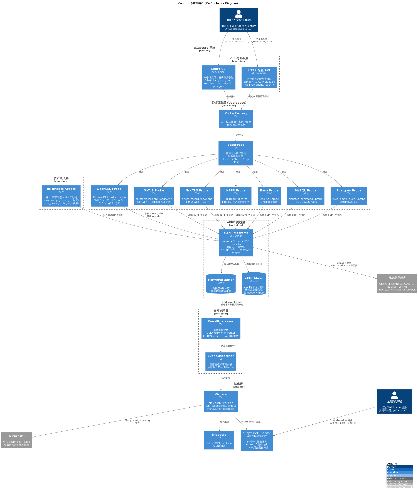

# 架构设计

本章面向开发者和希望深入理解 eCapture 工作原理的用户，介绍系统整体三层架构、探针框架设计以及事件处理流水线。

---

## 系统架构总览

---

## 本章内容

| 子页面 | 说明 |
|--------|------|
| [整体三层架构](整体三层架构) | eBPF 内核层、用户态探针层、CLI 与输出层的设计与数据流 |
| [探针框架与扩展机制](探针框架与扩展机制) | Domain 接口设计、BaseProbe 模板方法、工厂注册模式 |
| [事件处理流水线](事件处理流水线) | EventProcessor 调度、Worker 亲和性、协议解析器 |

---

## 核心设计原则

1. **分层解耦**：内核态 eBPF 程序 → 用户态探针引擎 → CLI/输出层，各层通过明确的接口通信
2. **工厂模式**：探针通过 `init()` 自注册到全局工厂，CLI 层无需直接依赖具体探针实现
3. **模板方法**：`BaseProbe` 提供探针生命周期的骨架，具体探针只需实现差异化逻辑
4. **观察者模式**：`EventDispatcher` 将事件分发给多个 `EventHandler`，支持灵活的输出组合
5. **CO-RE 兼容**：同时支持 BTF（CO-RE）和非 BTF（非 CO-RE）两种 eBPF 加载模式
